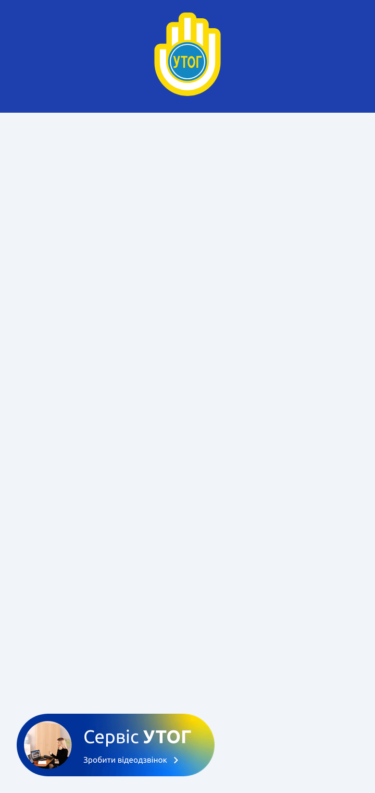

# Інтеграція кнопки «Сервіс УТОГ»

Цей репозиторій містить інструкцію з інтеграції кнопки **«Сервіс УТОГ»**, яка надає доступ до онлайн-сервісів Українського товариства глухих (УТОГ).


<p align="center">
  
</p>

## Як підключити

Щоб підключити кнопку «Сервіс УТОГ» до свого сайту, достатньо вставити наступний рядок перед закриваючим тегом `</body>` у вашому HTML-документі:

```html
<script src="https://utog.org/assets/uploads/files/js/serviceutog.js" async defer></script>
```

> **Важливо:** жодних додаткових налаштувань не потрібно. Скрипт автоматично завантажує та відображає кнопку на вашій сторінці.

## Приклад

```html
<!DOCTYPE html>
<html lang="uk" style="margin: 0; padding: 0; background-color: #f1f5f9; font-family: sans-serif;">
<head>
    <meta charset="UTF-8">
    <meta name="viewport" content="width=device-width, initial-scale=1.0">
    <title>Інтеграція кнопки «Сервіс УТОГ»</title>
</head>
<body style="margin: 0; padding: 0;">
    <header style="background-color: #1e40af; text-align: center;">
        
    </header>
  <!-- Контент сторінки -->

  <!-- Підключення кнопки Сервіс УТОГ -->
    <script src="https://utog.org/assets/uploads/files/js/serviceutog.js" async defer></script>
</body>
</html>
```

## Підтримка

З усіх питань звертайтесь до служби підтримки УТОГ.

03150, м. Київ, вул. Велика Васильківська, 74
Прийом у ЦП УТОГ: проводиться щоденно, крім святкових та
вихідних днів, пн-чт з 8:00 до 17:00, у пт з 8:00 до 15:45
Телефон: +38 063 101 97 09 (telegram, viber, whatsApp)
Ел. пошта: cputog@ukr.net
